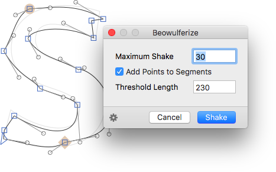

# Beowulferize
Glyphs.app filter for randomly moving glyph nodes around, creating an effect reminiscent of Letterror’s infamous Beowulf font, hence the name. After installation, 

1. trigger the filter with *Filter > Beowulferize,* 
2. enter a number for the maximum deviation of each point, 
3. choose whether you want to add extra points to long segments,
4. and if so, choose the minimum segment length,
5. and press the button:




### Custom Parameter

Use the gear menu in the lower left corner to copy a custom parameter with the current settings. You can then proceed to paste it in *File > Font Info > Instances,* in the *Custom Parameters* field of a listed font instance. At the end of the parameter value, add `; exclude:` or `; include:`, followed by a comma-separated list of glyph names, for excluding the indicated glyphs at export time, or limiting the filter’s effect to the glyphs, respectively. Example:

```
Beowulferize; shake:30.0; thresholdLength:230.0; exclude: a,b,c,adieresis
```

### Installation

1. In *Window > Plugin Manager,* look for *Beowulferize.*
2. Click the *Install* button next to its entry.
3. Restart Glyphs.

### Requirements

The plugin works in Glyphs 2.5 in High Sierra. I can only test it in current app and OS versions, and perhaps it works on earlier versions too.

### License

Copyright 2018 Rainer Erich Scheichelbauer (@mekkablue).
Based on sample code by Georg Seifert (@schriftgestalt) and Jan Gerner (@yanone).

Licensed under the Apache License, Version 2.0 (the "License");
you may not use this file except in compliance with the License.
You may obtain a copy of the License at

http://www.apache.org/licenses/LICENSE-2.0

See the License file included in this repository for further details.
